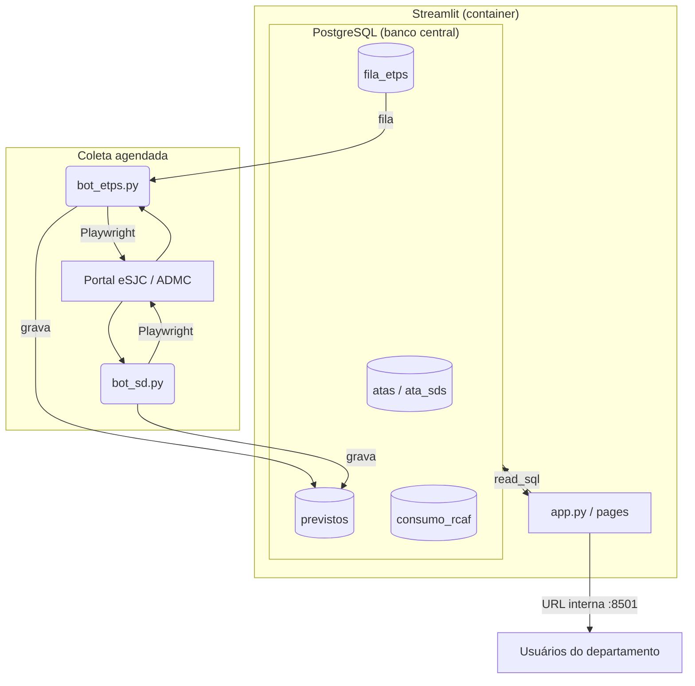
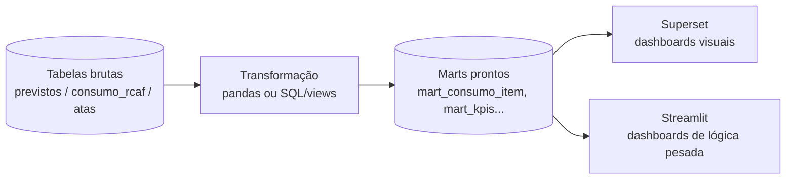

# Plano de Migração — Painel de Controle de Atas

> Objetivo geral: sair do modelo **CSV-na-raiz + distribuição por `.exe`** para um **app centralizado (URL) com banco de dados real**, preparando o terreno para virar um **portal de BI do setor de compras** (vários dashboards), sem reescrever a UI agora.

## Tese da migração

O gargalo de escala **não é o framework de UI**. São dois pontos:

1. **CSV/XLSX na raiz fazendo papel de banco** — sem acesso concorrente, sem transação, sem integridade; condição de corrida entre os bots (escrita) e o painel (leitura).
2. **Distribuição via `.exe` (PyInstaller), um por máquina** — o maior incômodo hoje, e que se resolve com **deploy central**, não com troca de framework.

Para <20 usuários internos com acesso aberto no início, **o Streamlit continua sendo a escolha certa**. A migração foca em trocar a fundação (banco + deploy), não a ferramenta de visualização.

## Arquitetura-alvo (pós Fase 1)



Tudo roda em containers (Docker) num servidor interno. Usuários acessam por um link. O `.exe`/`Instalador.bat` saem do fluxo.

---

# FASE 1 — Migração base

**Branch sugerida:** `migration/fase-1`
**Meta:** resolver distribuição + CSV-como-banco + bots interativos, mantendo o Streamlit e a lógica de negócio atual intacta.

### Fora de escopo da Fase 1 (deixar explícito para o agente)
- Autenticação / permissões por usuário (acesso interno aberto por enquanto).
- Superset e novos dashboards (Fase 2).
- Reescrita da UI em outro framework.
- Mudança nas regras de negócio existentes (capping 100%, SV quantidade→valor, preço praticado).

## 1.1 — Banco de dados PostgreSQL

Modelar as tabelas a partir dos CSVs/templates atuais. **Confirmar os nomes exatos das colunas contra os cabeçalhos reais** em `templates/*` antes de fixar o schema (o `base_rcaf` usa delimitador `;`).

Esquema proposto (ajustar nomes conforme os arquivos reais):

```sql
-- Metadados das atas (origem: base_sds.xlsx)
CREATE TABLE atas (
    id              SERIAL PRIMARY KEY,
    numero_ata      TEXT NOT NULL,
    ano             INT,
    objeto          TEXT,
    vigencia_inicio DATE,
    vigencia_fim    DATE,
    prorrogada      BOOLEAN DEFAULT FALSE,
    UNIQUE (numero_ata, ano)
);

-- SDs vinculadas a cada ata (normaliza as "até 16 SDs por linha" em linhas)
CREATE TABLE ata_sds (
    id        SERIAL PRIMARY KEY,
    ata_id    INT REFERENCES atas(id) ON DELETE CASCADE,
    numero_sd TEXT NOT NULL
);

-- Fila de ETPs para o bot (origem: base_etps.csv)
CREATE TABLE fila_etps (
    id           SERIAL PRIMARY KEY,
    numero_etp   TEXT NOT NULL,
    ano          INT,
    status       TEXT DEFAULT 'pendente',   -- pendente | processado | erro
    processado_em TIMESTAMP,
    UNIQUE (numero_etp, ano)
);

-- Itens planejados / teto previsto (saída dos bots; origem: previstos_dashboard.csv)
CREATE TABLE previstos (
    id            SERIAL PRIMARY KEY,
    ata_id        INT REFERENCES atas(id),
    codigo_material TEXT NOT NULL,
    descricao     TEXT,
    categoria     TEXT,            -- 'MAT' | 'SV'
    unidade       TEXT,
    qtd_prevista  NUMERIC,
    etp_origem    TEXT,
    atualizado_em TIMESTAMP DEFAULT NOW()
);

-- Execução financeira: RCs e AFs (origem: base_rcaf.csv, delimitador ';')
CREATE TABLE consumo_rcaf (
    id             SERIAL PRIMARY KEY,
    ata_id         INT REFERENCES atas(id),
    codigo_material TEXT NOT NULL,
    orgao          TEXT,           -- secretaria requisitante
    tipo_documento TEXT,           -- 'RC' | 'AF'
    numero_documento TEXT,
    quantidade     NUMERIC,
    valor_unitario NUMERIC,        -- preço praticado
    valor_total    NUMERIC,
    data_emissao   DATE
);

-- Índices para os filtros do painel
CREATE INDEX idx_previstos_mat   ON previstos (codigo_material);
CREATE INDEX idx_consumo_mat     ON consumo_rcaf (codigo_material);
CREATE INDEX idx_consumo_orgao   ON consumo_rcaf (orgao);
CREATE INDEX idx_consumo_ata     ON consumo_rcaf (ata_id);
```

**Tarefas:**
- [ ] Confirmar cabeçalhos reais dos templates e finalizar o schema.
- [ ] Criar script de schema (`db/schema.sql`) ou migração (Alembic, se quiser versionar).
- [ ] Script de carga inicial (`scripts/load_csv_to_db.py`) que importa os CSVs/XLSX atuais da raiz para as tabelas (idempotente: usar `UPSERT`/`ON CONFLICT`).
- [ ] **Validação:** comparar contagem de linhas e somatórios-chave (qtd prevista total, valor total de consumo) entre CSV e banco antes de considerar migrado.

## 1.2 — Camada de acesso a dados

- [ ] Criar `db.py` com engine SQLAlchemy a partir de `DATABASE_URL` e um helper `get_df(sql, params)` → `pd.read_sql`.
- [ ] Substituir os `pd.read_csv(...)` do `app.py` por consultas ao Postgres (ou `st.connection("sql")`).
- [ ] **Não alterar a lógica de merge/regras** — só trocar a fonte dos DataFrames. O objetivo é que o painel renderize idêntico ao de hoje.

## 1.3 — Refator dos bots (escrever no banco, rodar agendado)

- [ ] `bot_etps.py` e `bot_sd.py`: trocar a gravação em `previstos_dashboard.csv` por `UPSERT` na tabela `previstos`.
- [ ] Ler a fila de `fila_etps` (em vez de `base_etps.csv`) e marcar `status = 'processado'` ao concluir — substitui os checkpoints em arquivo por checkpoint no banco (mantém a proteção contra buscas duplicadas em quedas).
- [ ] **Credenciais institucionais (CPF/senha) via variáveis de ambiente / secret**, nunca digitadas no terminal nem commitadas. Modo headless para execução agendada.
- [ ] Agendamento: começar simples com **cron no host** chamando o container (`docker compose run --rm bots python bot_etps.py`). APScheduler/Celery ficam como evolução, não como requisito da Fase 1.

## 1.4 — Containerização e deploy central

`Dockerfile` (esqueleto):

```dockerfile
FROM python:3.12-slim
WORKDIR /app
COPY requirements.txt .
RUN pip install --no-cache-dir -r requirements.txt \
    && playwright install --with-deps chromium
COPY . .
EXPOSE 8501
CMD ["streamlit", "run", "app.py", "--server.port=8501", "--server.address=0.0.0.0"]
```

`docker-compose.yml` (esqueleto):

```yaml
services:
  db:
    image: postgres:16
    environment:
      POSTGRES_USER: ${POSTGRES_USER}
      POSTGRES_PASSWORD: ${POSTGRES_PASSWORD}
      POSTGRES_DB: ${POSTGRES_DB}
    volumes:
      - pgdata:/var/lib/postgresql/data
    restart: unless-stopped

  web:
    build: .
    environment:
      DATABASE_URL: postgresql+psycopg2://${POSTGRES_USER}:${POSTGRES_PASSWORD}@db:5432/${POSTGRES_DB}
    ports:
      - "8501:8501"
    depends_on:
      - db
    restart: unless-stopped

  bots:
    build: .
    environment:
      DATABASE_URL: postgresql+psycopg2://${POSTGRES_USER}:${POSTGRES_PASSWORD}@db:5432/${POSTGRES_DB}
      PORTAL_CPF: ${PORTAL_CPF}
      PORTAL_SENHA: ${PORTAL_SENHA}
    depends_on:
      - db
    profiles: ["jobs"]   # não sobe junto com o web; é acionado pelo agendador

volumes:
  pgdata:
```

`.env.example`:

```
POSTGRES_USER=painel
POSTGRES_PASSWORD=trocar
POSTGRES_DB=atas
DATABASE_URL=postgresql+psycopg2://painel:trocar@db:5432/atas
PORTAL_CPF=
PORTAL_SENHA=
```

**Tarefas:**
- [ ] Criar `Dockerfile`, `docker-compose.yml`, `.env.example` (e garantir `.env` no `.gitignore`).
- [ ] Remover do fluxo de distribuição o `run_painel.py`/`.exe` e `Instalador.bat` (manter no histórico, mas documentar que o acesso passa a ser por URL).
- [ ] Definir backup do volume `pgdata` (dump periódico do Postgres).

## 1.5 — Streamlit multipage (preparar a largura)

- [ ] Reorganizar para estrutura multipage: página inicial (landing do painel) + `pages/1_Atas.py` com o dashboard atual.
- [ ] Isolar funções de regra de negócio em módulo próprio (ex: `core/regras_atas.py`) — isso facilita reuso e a Fase 2.

## Critérios de pronto — Fase 1
- [ ] Painel de Atas roda **idêntico** ao atual, lendo do Postgres.
- [ ] Bots gravam no banco, rodam headless e agendados, com credenciais via env.
- [ ] App acessível por **URL interna**, sem `.exe`.
- [ ] Carga inicial validada (contagens/somatórios batem com os CSVs).
- [ ] Backup do banco configurado.

---

# FASE 2 — Novos dashboards do setor de compras (Superset)

**Branch sugerida:** `feature/dashboards-fase-2` (separada da Fase 1)
**Meta:** montar o esqueleto para escalar em **largura** — vários dashboards do setor de compras sobre o mesmo banco.

### Premissa que muda o desenho
Você indicou que os novos dashboards terão **ainda mais regras de negócio** do que o de atas. Isso reforça uma decisão de arquitetura: **regra de negócio não vive na ferramenta de BI**. O modelo visual do Superset/Metabase é ótimo para fatiar dados limpos, mas fica ruim para lógica linha-a-linha complexa.

A solução é uma **camada semântica (marts)**: um passo de transformação aplica as regras e materializa **tabelas prontas para visualizar** no Postgres. O Superset consome essas tabelas; a lógica pesada continua testável em Python/SQL.



### Esboço de tarefas (esqueleto, a detalhar quando abrir a branch)
- [ ] **Definir a camada de marts:** escolher entre views/materialized views no Postgres ou jobs em pandas que gravam tabelas-mart. Para regras versionáveis e testáveis, considerar dbt.
- [ ] **Migrar as regras de atas para a camada de modelagem** (capping 100%, SV quantidade→valor, preço praticado) como mart de referência — vira o padrão para os próximos.
- [ ] **Levantar os novos dashboards** do setor de compras: para cada um, mapear fonte de dados e classificar:
  - regra pesada → mart + **Streamlit**;
  - agregação/fatia simples → **Superset** direto sobre o mart.
- [ ] **Subir o Superset** como serviço no `docker-compose` (Postgres separado para metadados do Superset; usuário **read-only** no banco de dados de negócio).
- [ ] **Conectar o Superset ao Postgres**, registrar os datasets sobre os marts e criar **um dashboard-modelo** como referência de padrão visual.
- [ ] **Governança das regras:** documentar onde cada regra vive e criar testes para os marts (evita divergência entre dashboards).

> Observação de ferramenta: **Superset** (Python/Flask por baixo, mais poderoso e customizável) tende a ser a melhor escolha dado o volume de regras. **Metabase** é alternativa mais fácil de operar se algum dashboard for simples. Ambos são open source, self-hosted e **não exigem escrever React/Node**. Se o departamento já vive no Microsoft 365, o **Power BI** é o equivalente proprietário com a mesma lógica de "conectar no banco e montar".

---

## Resumo do backlog

**Fase 1 — `migration/fase-1`**
- [ ] Schema Postgres + script de carga inicial (validado)
- [ ] `db.py` e troca de `read_csv` por `read_sql` no `app.py`
- [ ] Bots gravando no banco, headless, agendados, credenciais via env
- [ ] Docker (`Dockerfile`, `compose`, `.env.example`) + deploy por URL
- [ ] Streamlit multipage + isolamento das regras em módulo
- [ ] Backup do banco

**Fase 2 — `feature/dashboards-fase-2`**
- [ ] Camada de marts (regras fora da BI)
- [ ] Mart de referência das regras de atas
- [ ] Levantamento e classificação dos novos dashboards
- [ ] Superset no compose + conexão read-only + dashboard-modelo
- [ ] Governança e testes dos marts
