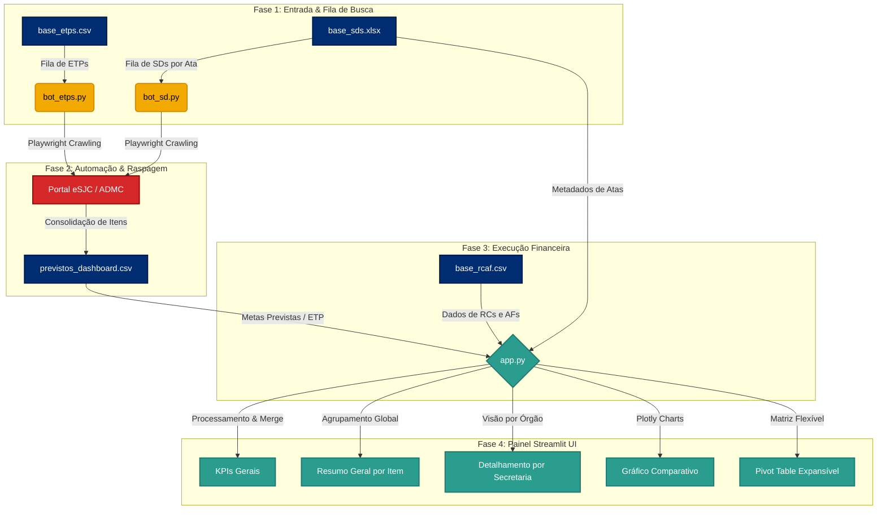
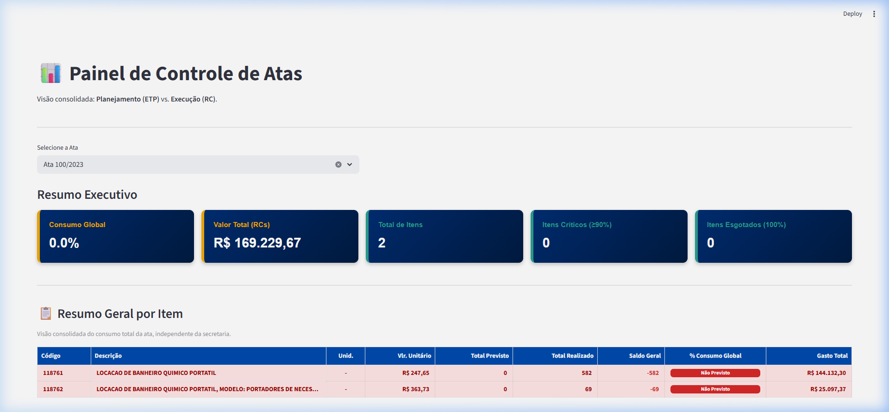
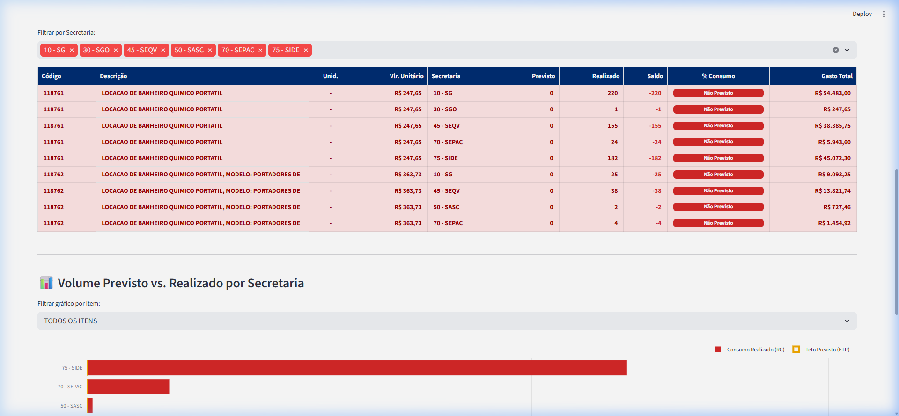
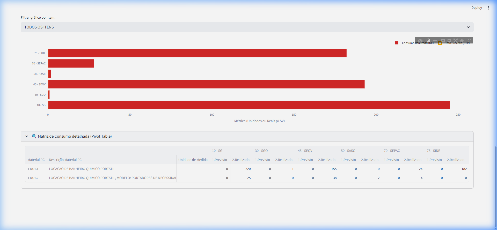

# 📊 Painel de Controle de Atas
> ** DRM - Departamento de Recursos Materiais | Registro de Preços**
>
> Uma ferramenta inteligente e analítica para o cruzamento de dados entre o **Planejamento (ETP - Estudos Técnicos Preliminares)** e a **Execução Financeira (RCAF - RCs e AFs de Consumo)**.

---

## 📋 Apresentação do Projeto

O **Painel de Controle de Atas** foi desenvolvido para apoiar os gestores públicos no monitoramento contínuo das Atas de Registro de Preços. O dashboard realiza o cruzamento automatizado de dados entre:
1. **O Planejado:** O volume teto aprovado nos Estudos Técnicos Preliminares (ETP) ou nas Solicitações de Despesas (SDs).
2. **O Consumido:** As Requisições de Compras (RCs) e Autorizações de Fornecimentos (AFs) efetivadas pelas diversas Secretarias.

Isso permite identificar imediatamente desvios de planejamento, itens próximos ao esgotamento (itens críticos), itens 100% consumidos e consumos não previstos (secretarias que consumiram itens sem provisão de ETP).

---

## ⚙️ Principais Regras de Negócio e Funcionalidades

*   **Controle Contratual (Capping):** O consumo acumulado na visão global é matematicamente limitado a 100% do teto previsto para cálculo de saldo, enquanto os KPIs destacam a pressão física real dos itens (críticos ≥90% e esgotados ≥100%).
*   **Valoração Unitária (Preço Praticado):** O painel adota exclusivamente o valor unitário praticado na execução financeira (RC). Itens planejados que ainda não possuam RC emitida exibem o valor unitário como um traço (`-`).
*   **Métrica de Serviços (SV):** Para itens categorizados como "SV" (Serviço), a base de cálculo (Previsto vs. Realizado) transita automaticamente de "Quantidades" para "Valor Financeiro" (Reais).
*   **Filtros Analíticos Combinados:** As tabelas de detalhamento suportam filtragem dinâmica e simultânea por **Código de Material** e por **Secretaria (Órgão)**.

---

## 🛠️ Stack Tecnológica

O projeto foi construído utilizando tecnologias modernas e eficientes no ecossistema Python:

*   **Interface e Visualização:** [Streamlit](https://streamlit.io/) — framework ágil para criação de aplicações web interativas de dados.
*   **Processamento e Análise de Dados:** [Pandas](https://pandas.pydata.org/) & [NumPy](https://numpy.org/) — manipulação eficiente de matrizes de dados e cruzamento (merge) relacional.
*   **Gráficos Interativos:** [Plotly](https://plotly.com/) — gráficos dinâmicos de barra empilhados e sobrepostos para análise comparativa.
*   **Automação e Scraping:** [Playwright](https://playwright.dev/python/) — robôs automatizados (`bot_etps.py` e `bot_sd.py`) para login seguro no portal eSJC/ADMC e raspagem de quantidades previstas.
*   **Excel Engine:** [openpyxl](https://openpyxl.readthedocs.io/) — manipulação de metadados e templates estruturados.
*   **Distribuição Local:** [PyInstaller](https://pyinstaller.org/) — empacotamento completo do dashboard em um único executável standalone (`run_painel.exe`) que elimina a necessidade de instalação do Python na máquina do usuário final.

---

## 📐 Fluxo de Dados e Arquitetura

O diagrama abaixo detalha a movimentação dos dados, desde a captação automática pelos robôs, passando pelo armazenamento intermediário, até o cruzamento relacional e visualização final:



---

## 📁 Estrutura de Templates (Uso Seguro de Planilhas)

Para evitar o versionamento indesejado de dados de consumo real ou informações sensíveis, o repositório possui uma pasta `/templates` contendo as estruturas vazias (com cabeçalhos exatos) que o sistema espera receber:

1.  **`templates/base_sds_template.xlsx`**: Metadados de vigência das Atas e a listagem de colunas para vincular as SDs de cada uma das Atas (suporta até 16 SDs por linha).
2.  **`templates/base_rcaf_template.csv`**: Histórico detalhado de consumo (RCs e AFs) com delimitador ponto e vírgula (`;`).
3.  **`templates/base_etps_template.csv`**: Fila de entrada contendo números e anos dos ETPs que o robô Playwright deve buscar.
4.  **`templates/previstos_dashboard_template.csv`**: Tabela de itens planejados resultante das automações, consumida diretamente pelo Streamlit.

> [!IMPORTANT]
> **Como Alimentar:** Faça uma cópia do template correspondente da pasta `/templates/`, renomeie para o nome original (removendo `_template`) e coloque-o diretamente na raiz do projeto antes de rodar o painel ou os robôs. Os arquivos na raiz estão blindados pelo `.gitignore`.

---

## 🚀 Como Executar o Painel

### Método 1: Via Executivo Standalone (Recomendado para Usuários Finais)
Basta dar dois cliques no arquivo executável local:
```bash
run_painel.exe
```
Isso abrirá um console local e, em instantes, seu navegador padrão abrirá a aplicação em `http://localhost:8501`.

### Método 2: Via Ambiente de Desenvolvimento Python
1. Certifique-se de ter o Python 3.9+ instalado.
2. Instale as dependências:
   ```bash
   pip install -r requirements.txt
   ```
3. Execute o servidor Streamlit:
   ```bash
   streamlit run app.py
   ```

---

## 🤖 Funcionamento das Automações (Robôs Playwright)

Se você precisa atualizar a base de previsões (`previstos_dashboard.csv`) buscando novos dados direto do Portal:

1.  **Bot de ETPs (`bot_etps.py`)**:
    Alimente a planilha `base_etps.csv` na raiz com os números de ETPs que deseja raspar. Execute o robô:
    ```bash
    python bot_etps.py
    ```
2.  **Bot de SDs (`bot_sd.py`)**:
    Alimente a planilha `base_sds.xlsx` na raiz com os dados das atas e seus respectivos números de SDs vinculadas. Execute o robô:
    ```bash
    python bot_sd.py
    ```

*Ambos os robôs solicitarão o Usuário (CPF) e a Senha institucional de acesso de forma segura através do terminal. O navegador Chromium abrirá automaticamente e executará as buscas, preenchendo o arquivo consolidado de planejamentos e registrando checkpoints para evitar buscas duplicadas em caso de quedas ou interrupções.*

---

## 📸 Demonstração Visual do Painel

Abaixo, apresentamos capturas reais do **Painel de Controle de Atas** em operação:

### 1. Resumo Executivo e KPIs de Controle
Visualização de cabeçalho com metadados da ata selecionada (vigência, objeto e status de prorrogação) seguidos por KPIs rápidos de consumo global, totais gastos e contagem de itens sob alerta crítico:


### 2. Visão de Planejado vs. Realizado por Secretaria (Plotly)
Gráficos dinâmicos que mostram visualmente os limites previstos (linhas amarelas) e o consumo real executado (barras azuis/vermelhas) por órgão requisitante:


### 3. Matriz de Detalhes e Relações Pivot
Uma matriz analítica expandida que cruza cada código de material com as previsões e realizações de cada Secretaria de forma matricial:

