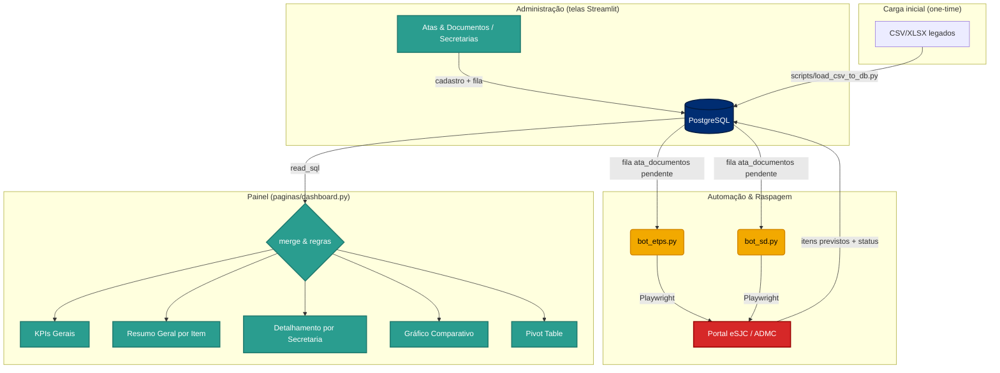

# 📊 Painel de Controle de Atas
> ** DRM - Departamento de Recursos Materiais | Registro de Preços**
>
> Uma ferramenta inteligente e analítica para o cruzamento de dados entre o **Planejamento (ETP - Estudos Técnicos Preliminares)** e a **Execução Financeira (RCAF - RCs e AFs de Consumo)**.

---

## 📋 Apresentação do Projeto

O **Painel de Controle de Atas** foi desenvolvido para apoiar os gestores públicos no monitoramento contínuo das Atas de Registro de Preços. O dashboard realiza o cruzamento automatizado de dados entre:
1. **O Planejado:** O volume teto aprovado nos Estudos Técnicos Preliminares (ETP) ou nas Solicitações de Despesas (SDs).
2. **O Consumido:** As Requisições de Compras (RCs) e Autorizações de Fornecimentos (AFs) efetivadas pelas diversas Secretarias.

Isso permite identificar imediatamente desvios de planejamento, itens próximos ao esgotamento (itens críticos), itens 100% consumidos e consumos não previstos (secretarias que consumiram itens sem provisão de ETP).

---

## ⚙️ Principais Regras de Negócio e Funcionalidades

*   **Controle Contratual (Capping):** O consumo acumulado na visão global é matematicamente limitado a 100% do teto previsto para cálculo de saldo, enquanto os KPIs destacam a pressão física real dos itens (críticos ≥90% e esgotados ≥100%).
*   **Valoração Unitária (Preço Praticado):** O painel adota exclusivamente o valor unitário praticado na execução financeira (RC). Itens planejados que ainda não possuam RC emitida exibem o valor unitário como um traço (`-`).
*   **Métrica de Serviços (SV):** Para itens categorizados como "SV" (Serviço), a base de cálculo (Previsto vs. Realizado) transita automaticamente de "Quantidades" para "Valor Financeiro" (Reais).
*   **Filtros Analíticos Combinados:** As tabelas de detalhamento suportam filtragem dinâmica e simultânea por **Código de Material** e por **Secretaria (Órgão)**.

---

## 🛠️ Stack Tecnológica

O projeto foi construído utilizando tecnologias modernas e eficientes no ecossistema Python:

*   **Interface e Visualização:** [Streamlit](https://streamlit.io/) — app multipage (Dashboard + telas de Administração), com navegação por `st.navigation`.
*   **Banco de Dados:** [PostgreSQL 17](https://www.postgresql.org/) acessado via [SQLAlchemy](https://www.sqlalchemy.org/) — fonte única de dados de atas, previstos e consumo (substitui os antigos CSV/XLSX).
*   **Processamento e Análise de Dados:** [Pandas](https://pandas.pydata.org/) & [NumPy](https://numpy.org/) — cruzamento (merge) relacional e aplicação das regras de negócio.
*   **Gráficos Interativos:** [Plotly](https://plotly.com/) — gráficos comparativos de Previsto vs. Realizado por secretaria.
*   **Automação e Scraping:** [Playwright](https://playwright.dev/python/) — robôs (`bot_etps.py` e `bot_sd.py`) que lêem a fila de documentos do banco, fazem login no portal eSJC/ADMC e gravam os previstos.
*   **Deploy:** [Docker](https://www.docker.com/) + Docker Compose — empacotamento reproduzível (Postgres + app) para rodar local ou em VM da intranet.

---

## 📐 Fluxo de Dados e Arquitetura

O diagrama abaixo detalha a movimentação dos dados, desde a captação automática pelos robôs, passando pelo armazenamento intermediário, até o cruzamento relacional e visualização final:

A arquitetura é centrada no **banco PostgreSQL**: o gestor cadastra atas e enfileira documentos pelas telas de Administração, os bots consomem essa fila e gravam os previstos, e o Dashboard apenas lê o banco.



---

## 📁 Carga inicial dos dados legados

Os dados de produção (`base_rcaf.csv`, `base_sds.xlsx`, `previstos_dashboard.csv`) **não** ficam no repositório (estão no `.gitignore`). A pasta `/templates` mantém as estruturas vazias, com os cabeçalhos exatos esperados, para referência do formato.

A migração dos dados legados para o banco é feita **uma vez** pelo script de carga, que roda no host contra o Postgres do compose:

```bash
# 1) Diagnostica os arquivos (status reais, itens SV, linhas sem ata) — não toca no banco
python scripts/load_csv_to_db.py --profile

# 2) Carrega tudo e valida (arquivo vs banco)
python scripts/load_csv_to_db.py
```

> [!IMPORTANT]
> Coloque os arquivos legados na **raiz** do projeto (copiando de `/templates/` e removendo o sufixo `_template`, ou usando os arquivos reais) antes de rodar a carga. Eles permanecem blindados pelo `.gitignore`.

---

## 🚀 Como Executar (Docker)

Pré-requisitos: Docker + Docker Compose. Postgres 17 sobe como serviço do compose.

```bash
# 1) Configure o ambiente
cp .env.example .env        # edite POSTGRES_PASSWORD, PORTAL_CPF/SENHA etc.

# 2) Suba o banco (o schema em db/schema.sql é aplicado automaticamente na 1ª vez)
docker compose up -d db

# 3) (Opcional) Carregue os dados legados a partir do host
python scripts/load_csv_to_db.py

# 4) Suba o painel
docker compose up -d --build app
```

O painel fica disponível em `http://localhost:8501`. A sidebar dá acesso ao **Dashboard** e às telas de **Atas e Documentos** e **Secretarias**.

> Para rodar sem Docker (ambiente Python local), aponte `DATABASE_URL` para um Postgres acessível, aplique `db/schema.sql`, instale `pip install -r requirements.txt` e rode `streamlit run app.py`.

### Backup do banco

```bash
./scripts/backup.sh                 # gera backup_atas_AAAAMMDD_HHMMSS.sql
# Restaurar:
cat backup.sql | docker compose exec -T db psql -U painel atas
```

---

## 🤖 Funcionamento das Automações (Robôs Playwright)

Os bots não têm mais arquivo de fila próprio: eles lêem a tabela `ata_documentos` (a fila alimentada na tela **Atas e Documentos**) e gravam os previstos no banco, marcando cada documento como `processado` ou `erro`.

1.  **Cadastre** a ata e **enfileire** os documentos (SD/ETP) pela tela de Administração — eles entram como `pendente`.
2.  **Execute** o bot correspondente (lê todos os pendentes daquele tipo):
    ```bash
    docker compose run --rm app python bot_sd.py
    docker compose run --rm app python bot_etps.py
    ```

As credenciais vêm das variáveis `PORTAL_CPF` / `PORTAL_SENHA` (no `.env`); se ausentes, o bot pergunta no terminal. O Chromium roda em modo headless por padrão (`BOT_HEADLESS=true`); defina `BOT_HEADLESS=false` para depurar vendo a tela. Reprocessar um documento é só usar **Reenfileirar** na tela (volta a `pendente`).

---

## 📸 Demonstração Visual do Painel

Abaixo, apresentamos capturas reais do **Painel de Controle de Atas** em operação:

### 1. Resumo Executivo e KPIs de Controle
Visualização de cabeçalho com metadados da ata selecionada (vigência, objeto e status de prorrogação) seguidos por KPIs rápidos de consumo global, totais gastos e contagem de itens sob alerta crítico:


### 2. Visão de Planejado vs. Realizado por Secretaria (Plotly)
Gráficos dinâmicos que mostram visualmente os limites previstos (linhas amarelas) e o consumo real executado (barras azuis/vermelhas) por órgão requisitante:


### 3. Matriz de Detalhes e Relações Pivot
Uma matriz analítica expandida que cruza cada código de material com as previsões e realizações de cada Secretaria de forma matricial:

